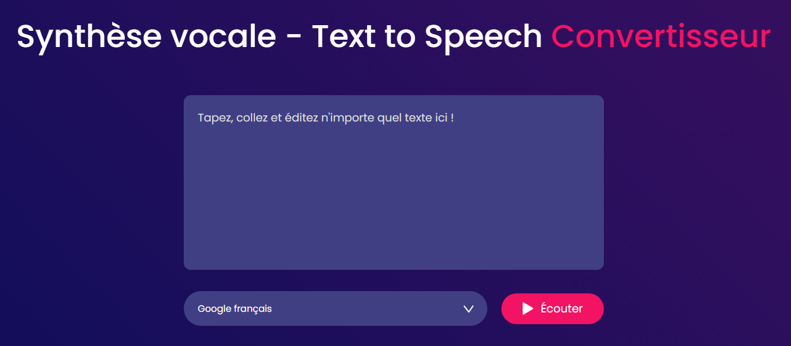

# Application de Synthèse Vocale 🎙

Cette application web permet à l'utilisateur de convertir du texte en parole à l'aide de la synthèse vocale. Elle a été créée en utilisant HTML, CSS et JavaScript.

## Fonctionnalités

- **Conversion de texte en parole:** Entrez le texte dans la zone de texte prévue à cet effet, puis cliquez sur le bouton de synthèse vocale pour écouter la parole générée.
- **Langues prises en charge:** L'application prend en charge plusieurs langues pour la synthèse vocale, offrant ainsi une expérience personnalisée à l'utilisateur.

## Installation et Utilisation

1. Clonez ce référentiel sur votre machine locale.
2. Ouvrez le fichier `index.html` dans votre navigateur web.
3. Entrez le texte que vous souhaitez convertir en parole dans la zone de texte.
4. Sélectionnez la langue dans le menu déroulant.
5. Cliquez sur le bouton de synthèse vocale pour écouter le résultat.

## Technologies Utilisées

- HTML
- CSS
- JavaScript

## Capture d'Écran

---

